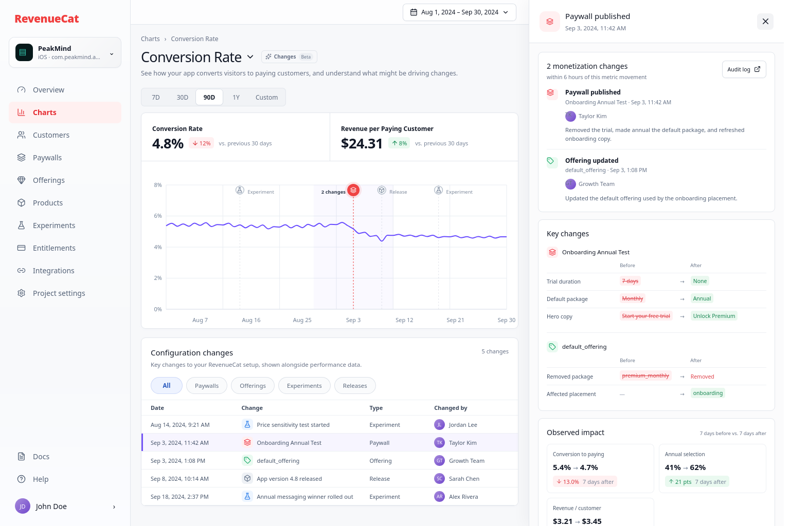

# RevenueCat ChangeLens

A small product prototype exploring how RevenueCat could surface monetization configuration changes directly inside Charts.

[Run locally](#running-locally) · [2-minute walkthrough](#demo)



When a subscription metric moves, one of the first questions is often: **what changed?**

RevenueCat already has both sides of that investigation. Charts captures business outcomes, while configuration and audit history capture changes to paywalls, offerings, experiments, and products. ChangeLens explores bringing those two contexts together.

## Problem

Teams investigating a metric movement have to leave the chart, inspect configuration history, and reconstruct the timeline themselves. The evidence exists, but the investigation loop is fragmented.

## Hypothesis

Overlaying meaningful configuration events directly on Charts could shorten that loop and give teams useful context before they begin deeper analysis.

## Demo

The prototype tells one focused story using synthetic data:

1. Conversion to paying falls from roughly 5.4% to 4.7% around September 3.
2. A chart marker shows that two monetization changes occurred nearby.
3. Selecting the marker reveals the related paywall and offering changes as semantic before/after diffs, followed by the metrics observed over the seven days before and after.

Markers for other dates open their own configuration details, impact data, and comparison windows. Filters update both the chart and the configuration table.

ChangeLens presents temporal context without assigning cause: a change occurring before a metric movement is evidence worth investigating, not proof that it caused the movement.

## Why this complements Rico

Rico is suited to deeper investigation and reasoning. ChangeLens provides deterministic, ambient context where a user first notices a metric movement, then offers Rico as a possible next step.

## Implementation

- Next.js App Router, React, and TypeScript
- Recharts for the metric series, comparison windows, and interactive event markers
- Tailwind CSS with a small set of purpose-built dashboard styles
- Typed local fixtures and component state; no backend or global state layer
- Static export for deployment as a Render Static Site
- A Puppeteer smoke test covering chart hydration, every marker, event-specific impact data, moving comparison windows, filtering, drawer dismissal, timestamps, and mobile layout

The main interaction lives in [`components/conversion-chart.tsx`](components/conversion-chart.tsx), the investigation panel in [`components/change-drawer.tsx`](components/change-drawer.tsx), and the synthetic domain data in [`data/demo-data.ts`](data/demo-data.ts).

## What I would validate next

- How often customers inspect audit history after noticing metric changes
- Which event classes matter enough to display on Charts
- Whether markers create visual noise for projects with frequent changes
- Whether app release events should be first-party or integration-driven
- Whether users prefer individual events or grouped change windows

## Intentionally out of scope

- Live RevenueCat API integration
- Persistence and authentication
- Causal inference
- AI-generated explanations or a live Rico integration
- Production analytics infrastructure
- A complete RevenueCat dashboard recreation

## Running locally

```bash
pnpm install
pnpm dev
```

Open [http://localhost:3000](http://localhost:3000). If that port is already occupied, run `pnpm dev -- --port 3100`.

Create the production static export with:

```bash
pnpm build
```

The generated site is written to `out/`. Run the production interaction checks with:

```bash
pnpm smoke
```

The smoke test uses the system Firefox browser and starts a temporary local server for the exported build.
